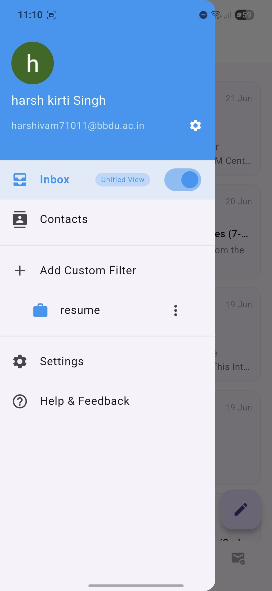

# 📬 Mail Flow – Unified Email Manager

**Mail Flow** is a Flutter-based cross-platform email manager that helps users integrate and manage both Gmail and Outlook accounts in one intuitive, responsive application. Built with modern Flutter architecture, secure OAuth authentication, and intelligent filtering capabilities.

---

## 🚀 Features

- 🔐 OAuth2 Login for Gmail & Outlook
- 📥 Unified Inbox for all connected accounts
- ⭐ VIP Inbox for important senders
- 🧾 Smart Custom Filters (create/edit/delete)
- 📎 Attachment Hub for quick file access
- 📬 Subscription Manager to easily unsubscribe
- ➕ Add multiple email accounts seamlessly
- 📱 Mobile-responsive, modern UI

---

## 📸 Screenshots

| Home | Add Email | First Screen |
|------|-----------|--------------|
|  |  |  |

| VIP Inbox | Attachments Hub | Unsubscribe Manager |
|-----------|-----------------|----------------------|
|  |  |  |

| Filter View | Create Filter | Add Filter |
|-------------|----------------|-------------|
|  |  |  |

---

## 🎥 Live Demo

📽️ *Coming soon* – Will showcase login, inbox, filters, and attachment module in action.

---

## 🧠 How It Works

### Gmail
- Auth via Google OAuth
- JSON response parsed with Dart models
- Uses `googleapis` package for mail & attachments

### Outlook
- Auth via AAD OAuth
- IMAP integration with `enough_mail`
- Mails and attachments parsed via MIME

---

## 🧩 Tech Stack

| Area           | Tool / Library                         |
|----------------|-----------------------------------------|
| UI/UX          | Flutter, Figma                          |
| Auth           | Firebase Auth, Google OAuth2, AAD OAuth |
| API Access     | `googleapis`, `enough_mail`, `http`     |
| Storage        | `flutter_secure_storage`, `shared_preferences` |
| Parsing        | MIME Parsing for attachments            |
| Preview        | `open_file`, `path_provider`            |
| State Mgmt     | SetState (basic), Local caching         |

---

## 📁 Folder Overview

---

## 🔐 Secure Storage

- `flutter_secure_storage`: stores access tokens
- `shared_preferences`: stores VIP list and filter configs
- No refresh token stored to reduce complexity and avoid silent security issues

---

## 📦 Features Breakdown

- **VIP Inbox:** Filters important senders
- **Attachments:** Parses & lists files from emails
- **Unsubscribe Module:** Smart unsubscribe option from newsletters
- **Custom Filters:** Dynamic email filtering with sender/keyword conditions

---

## 📈 Future Additions

- [ ] Auto-refresh token logic
- [ ] Email search & sorting
- [ ] Archive/Delete support
- [ ] Theme toggle (light/dark)

---

## 🛠 Development Model

- Modular & scalable architecture
- Light MVVM pattern
- UI-logic separation for testability

---

## 👨‍💻 Developer

Harsh Kirti Singh & Hardik Sonkar  

---

> 💡 *Want to contribute or have feedback? Open a pull request or drop a GitHub issue!*
